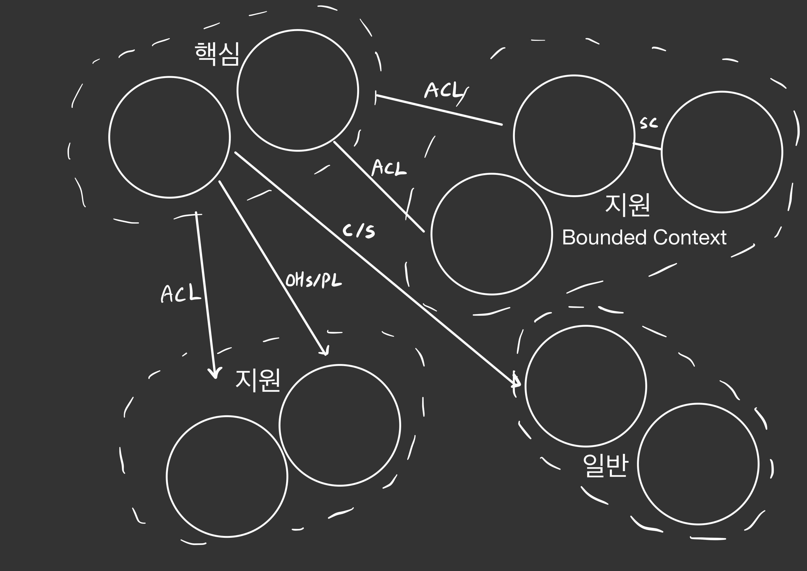

# DDD(Domain Driven Design)

## 등장 배경

소프트웨어의 개발이 복잡해지면서 개발자의 주도 하에 이루어진 소프트웨어가 비즈니스 요구사항을 완벽하게 충족시키지 못하는 상황이 발생하였다. 이를 해결하기 위해 개발자와 도메인 전문가의 협력 과정에서 함께 도메인 모델을 개발하고, 소통 내용을 통일화하기 위해 등장 하였다.

## Domain(도메인)

도메인은 각각의 기능적 문제의 영역을 정의하는 것이다. 비즈니스 도메인 -> 현실 세계의 기업의 주요 활동 영역 문제 도메인 -> 기업의 주요 활동 영역을 소프트웨어에서 해결하려고 하는 영역

## DDD란?

DDD는 에릭 에반스가 제안한 도메인을 중심으로 비즈니스 로직을 설계하는 개발 철학이다. 이 접근 방식을 통해 도메인에 집중하여 비즈니스 요구사항을 충족하는 소프트웨어를 개발할 수 있다.

* 무조건 DDD가 모든 개발에 있어서 해답은 아니다.(Not a Silver Bullet)

## 전략적 설계

전략적 설계란 문제 도메인을 소프트웨어 세계의 문제 공간으로, 또 해결 공간으로 설계해 나가는 일련의 과정이다.

우선, 비즈니스 도메인에서 해결하고자 하는 문제 도메인들을 간추려 도메인 문맥 내에서 보편 언어를 사용하여 도메인 전문가, 개발자들이 소통한다. 이 과정에서 도메인 지식이 없는 개발자들은 도메인 전문가들과의 '지식탐구(Knowledge Crunching)'를 통해 문제를 해결해야할 부분을 구체화한다.

그런 다음, 문제 도메인에서 하위 도메인인 핵심, 지원, 일반 도메인 등으로 추출하고 핵심 도메인에 집중적으로 자원을 투자한다. 이 때 핵심 도메인은 시간이 지남에 따라 변화할 수 있다.

이후 문제 공간에서 비즈니스 도메인을 구분하고(Bounded Context), 바운디드 컨텍스트 간의 관계를 정의(Context Mapping) 하며 해결 공간으로 설계, 진화해나간다.

바운디드 컨텍스트는 문제 해결을 위해 하위 도메인들을 구분하는 기준(문맥)을 의미한다. 지식탐구를 통해 바운디드 컨텍스트가 명료하게 이루어지는 것이 중요하고, 시간이 지남에 따라 문맥에 변동이 있을 수 있다. 컨텍스트 매핑은 바운디드 컨텍스트 안팎의 도메인간의 상호관계를 매핑하는 것을 의미한다.

## 전술적 패턴

전술적 패턴은 도메인 모델을 구성하는 구체적인 구현 패턴을 의미한다. 계층형 아키텍처, 엔티티, 값 객체, 리포지토리, 애그리것, 서비스, 팩토리 등의 구성 요소로 이루어져 있으며 이들을 전술적으로 활용하여 DDD를 구현한다.

계층형 아키텍처는 프리젠테이션 - 어플리케이션 - 도메인 - 인프라 계층 등의 계층화를 통해 도메인 모델을 보호하는 설계 방식이다. 이를 통해 관심사의 분리가 명확해져 도메인 코드의 응집도를 높힐 수 있다.

엔티티는 연속성과 식별성을 가지는 객체이다. 도메인에서 식별 가능한 유일 개체로서 핵심 역할을 수행한다. 다른 엔티티와의 관계를 표현할 수 있다.

값 객체(VO)는 변경 불가능하고 도메인 모델링에서 의미 있는 값을 표현할 때 사용하는 객체이다. 엔티티와 달리 식별자가 없으며 엔티티와 함께 사용하여 도메인 모델의 복잡성을 줄이고 유지보수성은 높히기 위해 사용된다.

서비스는 에그리것이나 값 객체 등으로 해결할 수 없는 행동 등을 처리할 때 사용되는 개념이다. 비즈니스 로직을 구현할 때 주로 사용되며 도메인 모델의 응집도를 높히고 결합도를 낮추어 유지보수성과 확장성을 향상시키는 역할을 한다. (Spring에서의 Service도 DDD의 Service에서 인용한 표현이라고 한다.)

애그리것(Aggregate)은 엔티티와 값 객체의 집합이다. 애그리것을 통해 엔티티와 값 객체를 논리적인 단위별로 묶음으로써 도메인의 경계를 명확히 설정하고 도메인 모델의 응집도를 높히는 역할을 한다. 또한 하나의 루트 엔티티를 가지고 있고 루트 엔티티만으로 다른 엔티티와 접근이 가능하여 일관성 있는 트랜잭션 처리와 데이터를 보장할 수 있다.

팩토리는 객체 생성을 추상화하는 패턴을 의미한다. 도메인 객체를 생성자를 통해 생성하는 것이 일반적이지만 객체 생성이 복잡하거나 유연성이 필요하다면, 이 과정을 추상화하여 객체 생성에 대한 의존성은 낮추고 코드의 유지보수성을 높힌다.

리포지터리는 도메인 객체의 저장소 역할을 하는 인터페이스이다. 리포지터리를 통해 도메인 객체의 CRUD 작업을 수행하고, 영속성을 보장하며 객체 상태의 변화를 추적하고 일관성을 유지할 수 있다.
