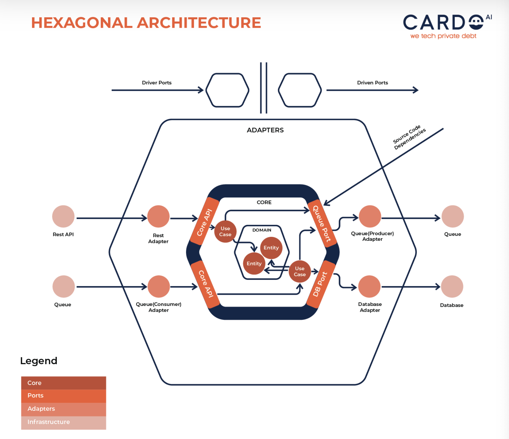

# Hexagonal Architecture

헥사고날 아키텍처는 도메인 중심 아키텍처 중 하나로 테스트가 용이하고 유연하고 유지보수성이 높은 소프트웨어 개발을 위해 고안된 아키텍처 패턴을 의미한다. 이는 비즈니스 도메인에 더욱 집중할 수 있도록 하는 패턴이다.

## 구조



### 코어

코어는 어플리케이션의 중심 부분에 위치한 요소로 어플리케이션 실행시 사용되는 도메인 모델과 그에 관한 비즈니스 로직을 포함한다. 이 때 외부로 향하는 의존성은 없으며 외부에서 코어로 의존하는 부분만 존재한다. (코어라는 이름답게 핵심적인 부분이다.)

### 포트

포트는 아키텍처에서 외부와 소통하는 통로를 의미한다. 그림에서와 같이 좌우측으로 포트가 형성되어 있는데 좌측은 drvier port, 우측은 driven port이다. 각각 어댑터 계층과 연결되어 있다.

### 어댑터 계층

가장 밖에 있는 계층으로 각각 Web 어댑터와 영속성 어댑터로서 기술적으로 코어를 호출하고 코어에 의해 호출되는 역할을 하는 계층이다. 

## 장점

### 테스트 용이성

비즈니스 규칙을 DB, 프레임워크 등과 분리함으로써 자동화된 테스트를 쉽게 작성하고 속도도 빨라진다.

### 유연성

마찬가지로 각 계층을 분리함으로써 비즈니스 규칙 내부를 건드리지 않고도 구체적 구현 부분을 변화시킬 수 있다.

### 비즈니스 도메인에 집중

가장 중요한 부분인 비즈니스 도메인을 핵심 부분으로 집중하여 개발할 수 있으며 이후에 기술적인 부분은 어댑터를 도메인에 맞추어 설계할 수 있다.

# POJO(Plain Old Java Object)

POJO는 2000년 마틴 파울러에 의해 개발된 용어로 어느 프레임워크나 라이브러리에 종속되지 않는 일반적인 객체를 의미한다. 말 그대로 일반 객체인데 사람들이 이를 부를 이름이 없어서 안쓰는 것 같아 이름을 지어줬다고 한다.

POJO는 일반적으로 변수와 Getter와 Setter 가지는 형태로 작성된다. 이는 작성도 깔끔하고 외부에 종속되지 않아 가독성과 재사용성이 높은 객체이다.
모델 객체, DTO, 단위테스트 등에서 사용된다.

POJO는 다음과 같은 속성을 가진다. 

- class 접근제어자는 public
- public인 기본 생성자가 보통 있음.
- 매개변수 있는 생성자도 있어도 됨.
- Getter, Setter 갖는 것 권장.

```

// POJO 예시
public class Person {
    private String name;
    private int age;

    public Person() {}

    public Person(String name, int age) {
        this.name = name;
        this.age = age;
    }

    // Getter and Setter methods
    public String getName() {
        return name;
    }

    public void setName(String name) {
        this.name = name;
    }

    public int getAge() {
        return age;
    }

    public void setAge(int age) {
        this.age = age;
    }
}

```

## 자바 빈즈와 비교

- 자바 빈즈는 serializable 해야함.
- 자바 빈즈는 getter와 setter로만 필드를 접근해야함.
- 자바 빈즈의 필드들은 다 private이어야 함.
- 자바 빈즈는 기본 생성자 필수